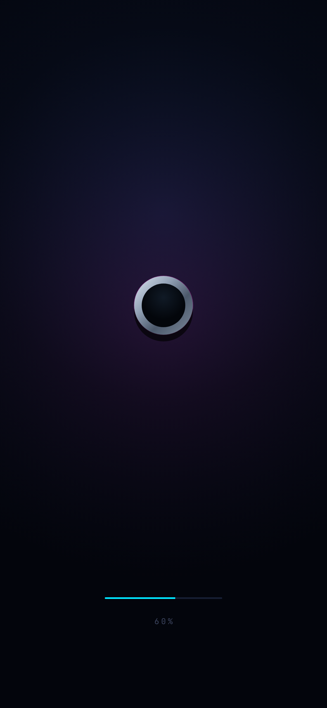
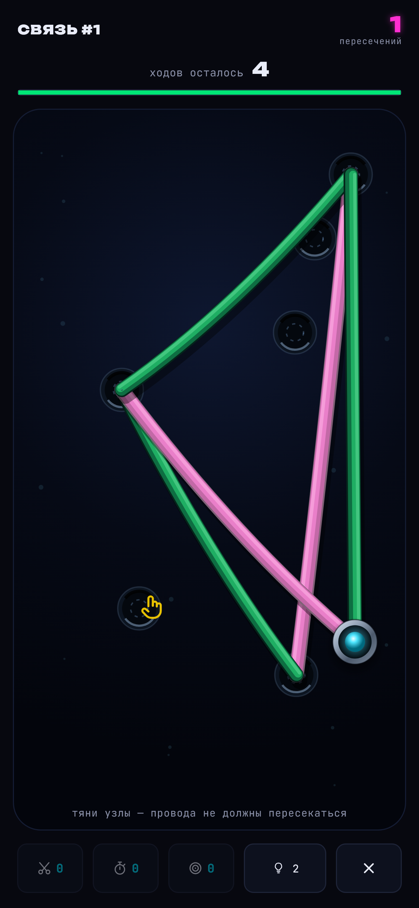
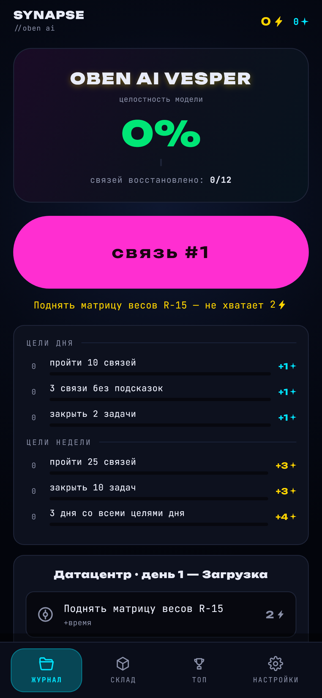
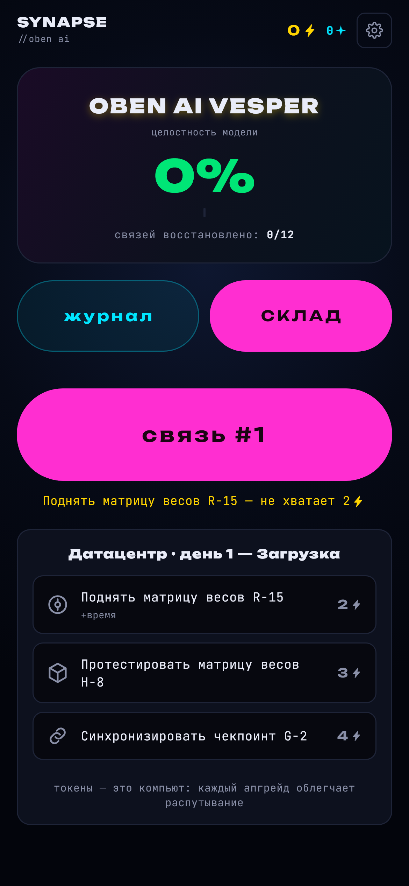
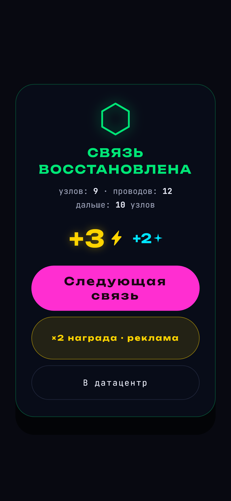

# SYNAPSE

Неоновая головоломка: распутывай провода повреждённой нейросети OM-9 и
возвращай ей память. Нативное Flutter-приложение — полный порт игры,
раньше жившей в одном `index.html`.

| | | |
|:---:|:---:|:---:|
|  |  |  |
|  |  |  |

- 9 языков (en / ru / es / fr / de / it / ja / ko / ar, включая RTL)
- 9 механик-препятствий, мосты, зоны протечки, бомбы, бонусы
- главы с сюжетом, датацентр с задачами, дневные цели и стрик
- магазин: бустеры, подсказки, 4 темы с разными материалами кабеля
- реклама только добровольная, за награду (AdMob + UMP-согласие)
- локальные напоминания (не чаще раза в сутки, в 19:00)
- синтез звука на лету, тактильная отдача, офлайн-работа

## Сборка

```bash
flutter pub get
flutter build apk --release        # Android → build/app/outputs/flutter-apk/
flutter build ipa --release        # iOS: ТОЛЬКО на macOS с Xcode —
                                   #   Apple не позволяет собирать ipa на других ОС.
```

iOS-проект полностью подготовлен (портретная блокировка, ATT-описание,
тестовый GADApplicationIdentifier) — на Mac достаточно открыть проект,
выбрать команду подписи и выполнить `flutter build ipa`.

Без Mac под рукой IPA собирает workflow `.github/workflows/ios-ipa.yml`
(репозиторий Victor-Northcode/synapse, приватный): GitHub Actions
запускает облачный macOS-раннер, собирает `flutter build ios --no-codesign`
и выкладывает `SYNAPSE-unsigned.ipa` артефактом. Запуск — любым пушем в
main или кнопкой «Run workflow». IPA не подписан: для установки нужен
Sideloadly/AltStore (подпишут вашим Apple ID) или сертификат разработчика
в секретах репозитория — для TestFlight/App Store.

Проверки:

```bash
flutter analyze
flutter test                       # генератор, движок, смоук UI, адаптив
                                   # (320x568…800x1280, языки ru/de/ar/ja)
flutter test test/screenshots_test.dart --update-goldens   # скриншоты экранов
```

Весь интерфейс рисуется векторами: иконки из спрайта игры (flutter_svg),
осколок ✦, галочки, крестики и шестиугольники — CustomPaint. Эмодзи и
шрифтовые символы не используются нигде.

## Структура

```
lib/
  main.dart              точка входа: ориентация, системный UI, сервисы
  core/                  палитра, звук (WAV-синтез), хаптика, сохранения,
                         реклама (AdMob/UMP), локальные уведомления
  data/                  СГЕНЕРИРОВАННЫЕ данные из исходного index.html:
                         строки 9 языков, сюжет, задачи, иконки; + game_data
  game/                  чистая логика: геометрия, генератор уровней
  state/                 AppState (профиль, глава, магазин, цели)
                         PlayState (движок одного уровня)
  ui/
    app_root.dart        слои экранов и оверлеев, тосты, кнопка «назад»
    screens/             загрузка, хаб, склад, настройки, игра
    overlays/            результат, карточка механики, сюжет, политика
    widgets/             поле (CustomPainter), сцены, иконки, кнопки
```

Файлы в `lib/data/` (кроме `game_data.dart`) сгенерированы из исходного
HTML — править только через генератор, чтобы не разойтись с переводами.

## Сохранения

`shared_preferences`, ключ `synapse_v1`, структура JSON один в один с
веб-версией: `{l,t,s,sh,hs,dk,st,gp,gd,inv,ads,th,ow,ch,dn,hbq,so,vi,pu,i,lg}`.
Не менять — формат единый и документированный.

## Перед публикацией

1. **Реклама.** Сейчас стоят официальные ТЕСТОВЫЕ блоки Google.
   Заменить: `lib/core/ads.dart` → `_realUnit`, и app id в
   `android/app/src/main/AndroidManifest.xml`
   (`com.google.android.gms.ads.APPLICATION_ID`). Тестовые id в
   проде — нарушение политики AdMob.
2. **Подпись.** Release пока подписывается debug-ключом. Создать
   keystore и прописать в `android/app/build.gradle.kts`.
3. **iOS.** Добавить в Info.plist `NSUserTrackingUsageDescription`
   (App Tracking Transparency) и портретную блокировку.

Правила продукта: реклама только за награду (никаких межуровневых и
баннеров), внутриигровых покупок нет — это осознанные решения владельца.

## Таблицы лидеров

Топ-100 «распутано связей», вкладки «за неделю» и «за всё время».
iOS — Game Center (таблицы `synapse.links` классическая и
`synapse.links.week` повторяющаяся с недельным сбросом), Android —
Play Games Services (один лидерборд, недельный срез платформенный).
Вход в одно касание, очки уходят при каждой победе, экран топа — свой
(медали топ-3, своя строка закреплена), полная таблица — системная.

Чтобы включить:
1. **iOS**: App Store Connect → приложение → Game Center → создать обе
   таблицы с ID выше; developer.apple.com → Identifiers →
   `com.synapse.link` → включить capability Game Center.
2. **Android**: Play Console → Play Games Services → Setup: создать
   проект, лидерборд; Project ID → `android/.../values/strings.xml`,
   ID таблицы (CgkI…) → `lib/core/leaderboard.dart` (`androidBoard`).
Кнопка-кубок в шапке прячется, пока таблицы не настроены.

## Лицензии

Код и материалы игры: © Pazl LLC, все права защищены.
Шрифты Unbounded и JetBrains Mono распространяются по SIL Open Font
License 1.1 — тексты лицензий лежат рядом со шрифтами в `assets/fonts/`.
